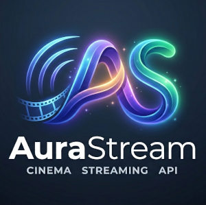

# AuraStream API

AuraStream is a high-performance backend API for a digital movie theater 
platform. It features a robust architecture supporting user authentication, 
catalog management, an interactive social system, and Stripe-integrated 
payments.

## 🚀 Key Features
* **Secure Authentication**: JWT-based login, account activation via email, 
and secure password reset.
* **Movie Catalog**: Comprehensive movie management with advanced filtering 
(year, rating, genre) and admin-only CRUD.
* **Shopping Cart & Orders**: Seamless transition from browsing to checkout 
with inventory-aware order placement.
* **Stripe Integration**: Real-time payment processing using Stripe Checkout 
and secure Webhook fulfillment.
* **Social Interactions**: User profiles, movie ratings, favorites, and nested 
comment systems.
* **Admin Dashboard**: Tools for user activation and role management.

## 🛠 Tech Stack
* **Framework**: FastAPI (Asynchronous Python)
* **Dependency Management**: Poetry
* **Database**: PostgreSQL with SQLAlchemy (Async)
* **Task Queue**: Celery with Redis (Email notifications)
* **Payment Gateway**: Stripe
* **DevOps**: Docker & Docker Compose


## 🔧 Installing / Getting started

### Using Poetry (Recommended)
1.  **Install dependencies**:
    ```bash
    poetry install
    ```
2.  **Activate environment**:
    ```bash
    poetry shell
    ```
3.  **Run the application**:
    ```bash
    uvicorn main:app --reload
    ```

### Using Docker
```bash
  docker-compose up --build
```

## 🧪 Testing

The project includes a comprehensive test suite (pytest-asyncio) covering authentication, business logic, and webhooks.

```bash
  pytest
```

## 🧑‍💻 Developing

Here's a brief intro about what a developer must do in order to start developing
the project further:

```shell
  git clone https://github.com/Slava-Nykonenko/AuraStream-API.git
  cd AuraStream-API/
  python -m venv venv
```

## 📖 API Documentation
Once the server is running, visit:

- Swagger UI: http://localhost:8000/docs
- ReDoc: http://localhost:8000/redoc

## 🤝 Contributing

If you'd like to contribute, please fork the repository and use a feature
branch. Pull requests are warmly welcome.
1. Fork the Project
2. Create your Feature Branch (git checkout -b feature/AmazingFeature)
3. Commit your Changes (git commit -m 'feat: Add some AmazingFeature')
4. Push to the Branch (git push origin feature/AmazingFeature)
5. Open a Pull Request

## Links


- Repository: [GitHub](https://github.com/Slava-Nykonenko/AuraStream-API)
- In case of sensitive bugs like security vulnerabilities, please contact
slava.nykon@gmail.com directly. We value your effort to improve the security 
and privacy of this project!
- Related projects:
  - [Statusphere](https://github.com/Slava-Nykonenko/statusphere)
  - [Emerald Railroads](https://github.com/Slava-Nykonenko/emerald-railroads)
  - [Skyway Airlines](https://github.com/Slava-Nykonenko/skyway-airlines)
  - [LibFlow](https://github.com/Slava-Nykonenko/libflow-api)

## 📄 Licensing
The code in this project is licensed under [MIT license](LICENSE.txt).


## 👤Author
Viacheslav Nykonenko<br>
[slava.nykon@gmail.com](mailto:slava.nykon@gmail.com)<br>
[GitHub](https://github.com/Slava-Nykonenko) |
[DockerHub](https://hub.docker.com/repositories/slavanykonenko) |
[LinkedIn](https://www.linkedin.com/in/viacheslav-nykonenko-49211b316/)<br>
+353 85 222 1534 <br>
Carlow, Ireland
